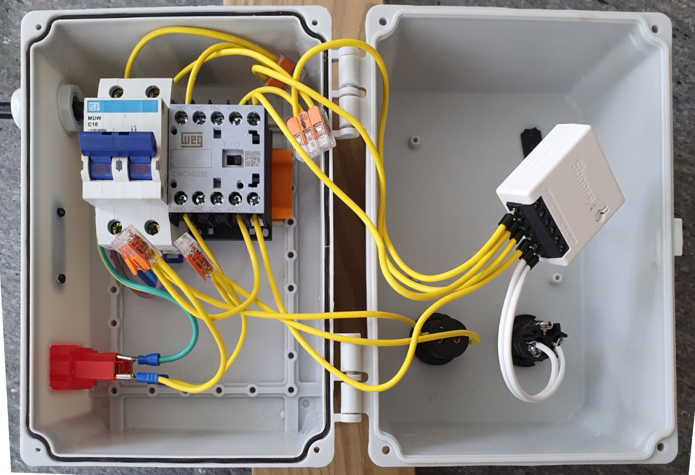
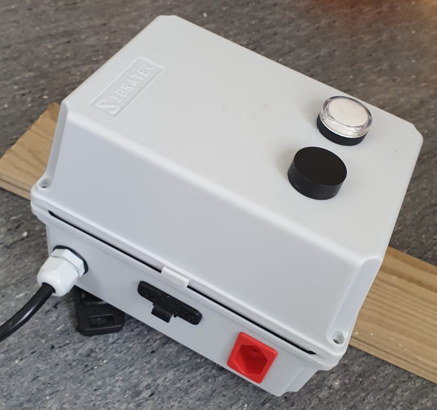
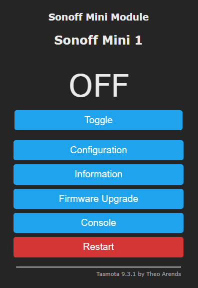

## TLDR

Como automatizar uma bomba de piscina usando Sonoff Mini e algum conhecimento sobre comandos elétricos e técnologia:

### Funcionamento

Um disjuntor é usado para permitir desativar completamente o painel de comando, assim como proteger contra sobrecarga elétrica. Um relê Sonoff é usado para acionar um mini contator de 10A. Quando o relê aciona, o mini contator aciona a bomba da piscina (assim a carga da bomba recai sobre o mini contator, não sobre o relê). Uma botoeira de comando elétrico de pulsar é usada para acionar manualmente o relê direto no painel. Uma luz led para painel de comando é usada para indicar quando o painel está ligado.

Com esta configuração, o relê pode ser acionado/desligado tanto manualmente diretamente no painel de comando como via aplicativo pela rede wifi. O acionamento pode ser feito manualmente e desativado via aplicativo ou vice-versa. Agora é possível automatizar o acionamento e desligamento da bomba usando algum servidor de automação residencial ou até mesmo assistentes como Alexa, Google Home ou Samsung Smarthings, e o funcionamento manual continua intuitivo para qualquer pessoa, incluindo profissionais que vem dar manutenção na piscina.

> Não tenho treinamento formal em engenharia elétrica. As técnicas e procedimentos que explico e demonstro neste post foram realizadas com o máximo de cuidado e equipamentos de segurança e após realizar extensas pesquisas sobre normas e padrões de segurança adotados no Brasil (NBR 5410) e no exterior e consultando alguns profissionais que conheço. O dimensionamento dos dispositivos foi realizado para atender às necessidades específicas do problema em questão. 

<!--more-->

## Histórico e motivação

Sempre gostei de saber como as coisas funcionam e isso me levou a diversos interesses diferentes como elétrica residencial, arquitetura básica, marcenaria, pequenos reparos, conhecimentos básicos de engenharia e mais recentemente automação residencial.

Sempre achei interessante a ideia de casas inteligentes, mas nunca gostei muito da idéia de depender de soluções de terceiros fora do meu controle, principalmente por questões de privacidade e segurança, mas também por usabilidadde e praticidade. Não faz sentido, por exemplo, instalar uma lâmpada que pode ser controlada por aplicativo no telefone ou por voz mas perder o funcionamento normal via interruptor na parede, ou pior, ter o controle no interruptor mas este controle passar pelo controlador "inteligente" e só funcionar se a internet estiver funcionando e o site do fabricante do dispositivo de automação estiver no ar.

Com isso em mente, sempre imaginei que só teria alguma solução de automação em casa quando atendesse a alguns requisitos:

- Seu funcionamento não deve depender de conexão com internet ou até mesmo wifi. Conexão deve ser um complemento da funcionalidade, não um requisito.
- Deve haver um modo de interação manual/tradicional sempre que possível e fizer sentido. Pessoas "normais" devem ser capazes de interagir com os dispositivos automatizados da forma mais natural possível e ter as automações apenas como complemento. Esses modos de uso "natural" devem funcionar sem depender de controlador central, wifi ou internet.
- Sempre que possível, os dispositivos inteligentes não devem depender da internet para funcionar, sendo possível tirar proveito dos seus recursos e funcionalidades mesmo se estiver sem internet em casa ou o servidor do serviço estiver fora do ar (ou seja, deve funcionar localmente)

Quando descobri os relês inteligentes da Sonoff, achei bem legal, mas na época eles ainda não davam suporte a funcionamento 100% local. Havia a opção dos relês Shelly, mas esses são bem mais difíceis de obter no Brasil, e consequentemente são mais caros também.

Acompanhando o canal sobre automação [The Hook Up](https://www.youtube.com/c/TheHookUp) no Youtube eu fiquei sabendo sobre o modo DIY do Sonoff e sobre o firmware alternativo Tasmota. Ambos antendiam às minhas necessidades e decidi pelo Tasmota (mais detalhes em outro post).

Comprei 2 relês Sonoff Mini, instalei Tasmota neles (mais detalhes em outro post), os configurei na minha rede wifi e agora era capaz de controlar "algo" via wifi ou por algum comando direto no próprio relê.

Decidi que o meu primeiro projeto seria automatizar a iluminação da árvore de natal (mais detalhes em outro post). Após o sucesso, decidi fazer algo um pouco "maior", e controlar a bomba da piscina da casa que moramos.

A decisão de controlar a bomba da piscina tem várias motivações:

- A casa de máquinas que abriga a bomba é um quartinho bem úmido e relativamente incômodo de acessar.
- Não havia nenhum tipo de comando ou interruptor para ligar e desligar a bomba. Ela estava sendo controlada por um timer mecânico simples, que já não servia mais como timer em si mas ainda era possível usar sua chave de liga e desliga. Esse timer já era usado quando pelo inquilino anterior (pelo seu estado, já era velho).
- Sempre que se usa a piscina é recomendado que se mantenha a bomba acionada, para que circule e filtre a água, mas eu não me sentia 100% seguro acionando ou desativando a bomba da forma que estava estando descalso ou apenas de chinelo e roupa de banho (ou até molhado).
- É recomendado filtrar a água periodicamente para diminuir a necessidade de químicos na manutenção, mas com frequencia esquecíamos a bomba ligada e só percebíamos ao ouvir o barulho na hora de dormir. Então precisava ir até o abrigo da bomba a noite para desligá-la.

Uma coisa que me incomodava muito e até preocupava era a questão de usar esse timer como interruptor para acionar a bomba. Eu sempre via um brilho de fagulha dentro dele quando acionava, devido à carga de partida e sempre tive o receio de algum dia haver um curto ou algum acidente elétrico.

Minha intenção agora era passar a controlar o acionamento da bomba usando um Sonoff Mini, mas eu queria que qualquer pessoa que viesse realizar alguma manutenção na piscina também fosse capaz de acionar a bomba e que isso fosse feito de forma segura. O relê Sonoff suporta carga de até 10 ampéres de corrente e a bomba usa entre 4A e 6A enquanto ativa, mas todo motor requer uma carga bem mais alta para dar partida e a parte eletrônica do relê não aguentaria esses picos de carga por muito tempo (nunca nem tentei ligar direto para não arriscar queimar o relê).

Para controlar motores e cargas semelhantes em comandos elétricos o correto é usar um dispositivo chamado Contator. Esse dispositivo tem por objetivo controlar uma carga elétrica, isolando o sinal de comando sem sobrecarregá-lo.

Com isso, temos a solução que descrevi no início deste post. Agora posso controlar a bomba da piscina via wifi pela interface web bem facilmente ou indo até o abrigo e acionando o botão no meu novo painel de comando.

### Equipamentos e dispositivos
- 1 relê Sonoff Mini
- 1 mini contator auxiliar 220v de 10A
- 1 disjuntor bipolar de 10A
- cabos elétricos de 2,5 mm2 para montagem do painel
- caixa para montagem do painel
- botoeira de comando elético de pulsar
- sinaleiro de led 220v para comando elétrico
- 1 tomada 10A para painel de comando elétrico
- 4 derivadores Wago de 3 vias

### Explicação básica da montagem
- Configurar o relê Sonoff Mini com firmware personalizado Tasmota e em modo de pulso (em modo pulso o relê irá comutar entre ligado e desligado sempre que for fechado o contato nos seus terminais de comando)
- Conectar a alimentação principal na entrada disjuntor
- Conectar as 2 saídas do disjuntor em 2 derivadores Wago
- Conectar as 2 entradas do relê nos 2 derivadores Wago
- Conectar as 2 saídas do relê nos contatos de comando do mini contator
- Conectar os 2 terminais de comando do relê na botoeira de comando
- Conectar as 2 entradas abertas do mini contator no 2 derivadores Wago
- Conectar as 2 saídas abertas do mini contator nos outros 2 conectores Wago
- Conectar a tomada nesses 2 conectores de saída do mini contator
- Conectar o sinaleiro led nesses 2 conectores de saída
- Ligar o cabo de alimentação principal do painel no painel de distribuição da piscina
- Ligar a bomba da piscina na tomada vermelha exposta na lateral do painel

### Resultado final

#### Painel de comando

Ignorem o fato de todos os cabos serem amarelos. Quando fiz este painel eu só tinha esta cor na bitola necessária. Vou corrigir isso no futuro quando fizer algum um upgrade ou manutenção neste painel.

Botão de acionamento e uma luz de indicação de funcionamento na tampa

Tela de controle direto do relê Sonoff com firmware Tasmota acessível pelo browser.

Eu também configurei regras na nossa Alexa para conseguir acionar e desligar a bomba da piscina usando comando de voz.
